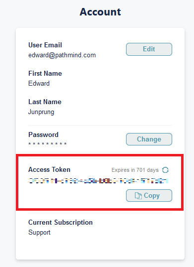
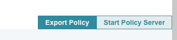

# Pathmind simulation Python API

Pathmind provides an interface to implement and train reinforcement learning policies, using Python-based simulations, in the cloud.
This may be useful for people who:

- Prefer to simulate real-life scenarios using Python versus a simulation IDE such as AnyLogic.
- Want to leverage the cloud to train reinforcement learning policies in parallel but prefer not to implement and maintain their own cloud infrastructure.

## Installation

You can get the Pathmind API from PyPI:

```shell
pip install pathmind
```

or clone this repo and run

```shell
python setup.py install
```

## Usage

To use this API you have to implement the `Simulation` interface provided in `simulation.py`.
This requires you to implement eight intuitive methods for your simulation.
See the following two examples to understand the mechanics behind Pathmind's Python API.

- **Single Agent Example**: [Mouse chasing cheese example](https://github.com/PathmindAI/pathmind-api/blob/main/tests/examples/mouse/mouse_env_pathmind.py)
- **Multi-Agent Example** - [Multiple mouses chasing cheese example](https://github.com/PathmindAI/pathmind-api/blob/main/tests/examples/mouse/multi_mouse_env_pathmind.py)

Once you have a `Simulation` ready, you can use it to train a model with Pathmind
as follows.

To get started, please [register for a Pathmind account](https://app.pathmind.com/sign-up).
The following items are required to utilize Pathmind's training infrastructure.
Once registered you need to find your [pathmind.com](pathmind.com) access token from your account as shown in
the following figure:



Copy this token and set the environment variable `PATHMIND_TOKEN` with it.

### Training a Pathmind Policy

Then, assuming you have defined a simulation called `MySim` in the file
`my_sim.py`, you can run

```python
from my_sim import MySim

simulation = MySim()
simulation.train()
```

in a Python shell started in the same directory you've defined `my_sim.py`.
If your simulation has special requirements in terms of extra Python packages
needed, you can add a `requirements.txt` next to your script.
Of course, this procedure also works for more complex setups in which you have
one or several Python module folder from which you import your simulation code.
That means your folder structure might look as follows:

```text
.
|____requirements.txt
|____my_module
| |______init__.py
| |____my_sim.py
```

After you run `.train()` on your simulation, you'll see a URL for your Pathmind experiment prompted:

```text
>>> See your Pathmind experiment at:
	https://app.pathmind.com/editGoals/6190?experiment=17157
```

If you click on that link, you can start or stop the training, and see the results once the training procedure finished.

### Running your simulation with a Pathmind Policy

Once your Pathmind experiment successfully completed, you want to see if it "works", i.e. if the trained policy gives you results you expect when running your simulation with it.
To do this you essentially have two options, namely starting a policy server hosted by Pathmind, or running the model yourself locally.
In the Pathmind web application you can choose between the two in your respective experiment.



#### Starting a Pathmind Policy Server

If you opt to work with the Pathmind-hosted solution, you can click on "Start Policy Server" on your experiment,
which spins up a server hosting your Policy and an easy way to get actions for your simulation.
All you need to run your simulation with a policy server is the `url` that server is running on and the `api_key` Pathmind provides you with.
Please see [this article](https://help.pathmind.com/en/articles/5395946-integrating-trained-policies-in-web-applications) for more details.

```python
from my_sim import MySim
from pathmind.policy import Server

simulation = MySim()
policy = Server(url="<policy-server-url", api_key="<api-key>")
simulation.run(policy)
```

#### Running the model locally

If you opt to run the policy yourself locally, you have to click "Export Policy" in the web interface instead.
This will give you a zip file that you need to unpack locally, next to your simulation code.

```python
from my_sim import MySim
from pathmind.policy import Local

simulation = MySim()
policy = Local(model_file="<path-to-your-model-folder")
simulation.run(policy, out_csv="output.csv")
```

#### Using random actions for comparison

Sometimes you might want to run a policy against a baseline to see how it fares - and random actions are often a good such baseline.
To use random actions, instead of a Pathmind Policy, to run your simulation use:

```python
from my_sim import MySim
from pathmind.policy import Random

simulation = MySim()
policy = Random()
simulation.run(policy)
```

## Discussion

The interface is inspired by OpenAI gym, but differs in certain points:

- A Pathmind `Simulation` works for single and multiple agents.
- You only define dictionaries of reward contributions, not a single reward value.
  Reward functions can be crafted the Pathmind app, without
  having to go back to your original Python implementation. If you don't provide any function,
  all contributions will be summed up by default
- Similarly, you can provide as many useful observations as you like and later
  select which ones to use for training in the Pathmind app.
- You can rely on Pathmind's scalable backend for training and don't have to
  run your workloads on your machine.
